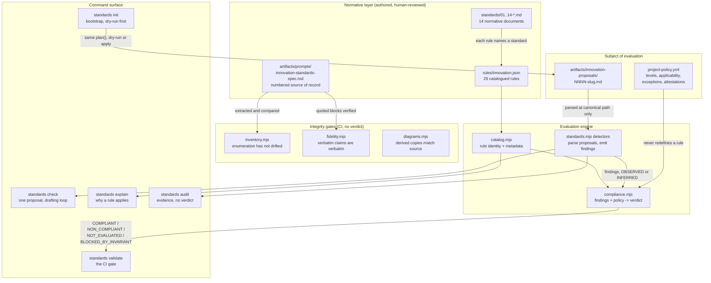

# Architecture — InnovationStandards

> A standalone, policy-as-code standards repository for innovation decisions. It provides fourteen
> numbered standards, a catalog of thirty machine-identified rules, and a command-line tool that
> evaluates innovation proposals against them. Its users are the people and AI agents who decide what
> gets built — and its central claim is that it evaluates **the quality and integrity of the decision
> process, not whether the idea eventually succeeds**. A `COMPLIANT` verdict means the reasoning met
> the bar; it never means the idea is good.

## Tech stack

| Layer | Technology |
|---|---|
| Runtime | Node.js ≥ 18, ES modules (`"type": "module"`) |
| Dependencies | **None.** Zero third-party packages; CI has no install step |
| Tests | `node:test` + `node:assert/strict`, run by `node --test "test/*.test.mjs"` |
| Configuration | YAML (strict hand-written subset parser) and JSON Schema (hand-written evaluator) |
| Normative content | Markdown, with a parseable field grammar |
| Diagrams | Mermaid; `.mmd` is canonical and the Markdown copy is derived |
| CI | GitHub Actions, seven sequential checks |

The zero-dependency constraint is structural rather than aspirational, and is recorded in
[ADR 0001](../artifacts/adr/0001-vendored-engine-standalone-repo.md): a supply-chain compromise in a
tool that certifies compliance is a compromise of every certification it has issued.

## What makes this repository different from a code auditor

An engineering standards tool audits **a repository**: files exist or they do not, a workflow runs or
it does not. This tool audits **a decision made before code exists** — whether a problem was
identified before a solution was chosen, what evidence supports the claims, what the work will cost,
and what would make it stop.

That difference produces the architecture below. The unit of evaluation is not the repository; it is a
**proposal artifact**. See [ADR 0004](../artifacts/adr/0004-proposal-artifact-is-the-audit-surface.md).

## System diagram



## The separation of powers

One architectural rule governs the whole system, and every module comment restates it:

> The **catalog** defines rule identity and metadata.
> **`project-policy.yml`** defines project applicability.
> The **evaluator** produces evidence.
> **None of the three may redefine the others.**

This is why the milestone order was catalog-before-evaluator: an evaluator built first inevitably
grows a private copy of rule metadata, and then two things define what a rule means. `assertBindings`
enforces the boundary mechanically — a detector reporting a rule id the catalog does not define throws
rather than being silently accepted.

## Runtime processes

There is one, and it is short-lived. This is a command-line tool, not a service: no server, no
database, no scheduled job, no background worker, no network access.

### `standards` CLI

- **Host:** invoked directly by a developer, an AI agent, or a CI step
- **Entry point:** `scripts/standards.mjs`
- **Purpose:** loads the rule catalog and the project policy, walks a repository, parses proposal
  artifacts, produces findings and a verdict, and exits with a code that CI can gate on
- **Lifetime:** one process per invocation; no state persists between runs

**Determinism is a contract.** `check` and `explain` are pure functions of the catalog, the policy,
and the files on disk. Two runs over unchanged input produce byte-identical output — no model call, no
network, no clock dependence beyond an explicitly passed date. A standards tool whose output varies
between identical runs cannot be audited.

## Commands

Designed around the domain's workflows rather than copied; the reasoning, including two rejected
commands, is in [`design/cli-design.md`](../design/cli-design.md).

| Command | Purpose |
|---|---|
| `standards init [--dry-run] [--force-overwrite=<path>]` | Bootstrap a target project: proposal directory, seeded template, policy, agent instruction files. Creates missing files; never overwrites without a per-path opt-in |
| `standards check <proposal>` / `--all` | Evaluate one proposal (or all) and report its conclusion in the AI vocabulary. This is the drafting loop |
| `standards explain <rule-id>` / `<proposal>` | Read-only. Why a rule applies, what satisfies it, what its remediation is, which requirement defines it |
| `standards audit [path] [--strict]` | Evidence discovery. Reports what exists; produces no verdict without a policy |
| `standards validate [path]` | The authoritative verdict. **The command CI gates on** |

All accept `--json`. Exit codes: `0` clean, `1` findings or non-compliance (including
`BLOCKED_BY_INVARIANT`), `2` the tool could not run.

`init` computes a plan of `{path, action}` entries and then either renders it (`--dry-run`) or applies
it. One plan function, two consumers — a dry run computed separately from the apply is not a preview,
it is a second implementation that agrees until it does not.

## Components

### Normative layer — authored, human-reviewed

| Path | Responsibility |
|---|---|
| `artifacts/prompt/original-prompt.md` | The authored intent, untouched |
| `artifacts/prompts/innovation-standards-spec.md` | The numbered source of record. Mechanically extractable; quoted blocks are verified against it |
| `standards/01..14-*.md` | Fourteen normative documents. Each carries `## Scope`, `## Requirements` with `### RN — Title` headings, `## Additions this standard makes beyond the source`, `## Relationship to other standards`, and `## Implementation` |
| `rules/innovation.json` | The rule catalog: thirty rules, each with an id, level, severity, validation type, assurance, and lifecycle fields |
| `artifacts/adr/` | Five decision records |
| `design/` | The concept-map investigation and the CLI design |

The `### RN — Title` headings are load-bearing: findings carry `standardRef` anchors into them, and a
test asserts every anchor resolves to a heading that exists.

### Evaluation engine

| Module | Responsibility |
|---|---|
| `scripts/catalog.mjs` | Loads and validates every `rules/*.json`. Throws rather than loading partially — a partial catalog silently shrinks the denominator every score is computed over |
| `scripts/compliance.mjs` | Turns findings plus policy into a verdict. Owns applicability, exceptions, attestations, and the five statuses |
| `scripts/standards.mjs` | The CLI: repository walk, proposal parsing, detectors, rendering, exit codes |
| `scripts/policy.mjs` | Validates `project-policy.yml` against the schema and reports compliance conditions such as an expired exception |
| `scripts/yaml.mjs` | A strict YAML subset parser. No anchors, block scalars, flow collections, duplicate keys, or tabs — all hard errors |
| `scripts/jsonschema.mjs` | A JSON Schema evaluator that throws on any keyword it does not implement, rather than ignoring it |
| `scripts/init.mjs` | The bootstrap plan/apply contract |

### Integrity gates — no verdict, only drift detection

| Module | What it proves |
|---|---|
| `scripts/inventory.mjs` | The standards enumeration extracted from the spec still agrees with the committed, human-reviewed inventory. It never regenerates that inventory — a parser that becomes more forgiving cannot redefine how many standards exist |
| `scripts/fidelity.mjs` | Every block a standard claims is verbatim source actually appears in the spec. Whitespace is normalised; backticks, punctuation, and wording are not |
| `scripts/diagrams.mjs` | Every `.mmd` appears verbatim as an embedded fence, and any committed `.svg` records the hash of its source |

These three ran green **before the first standard was written**, which is what makes them constraints
on the normative content rather than a description of it added afterwards.

## The three epistemic axes

The subtlest thing in the system, and the one most easily destroyed by a well-meant simplification.
Three vocabularies grade three different things, and they compose rather than compete:

| Axis | Vocabulary | Grades | Lives in |
|---|---|---|---|
| Evidence level | `observation`, `assumption`, `hypothesis`, `user-evidence`, `market-evidence`, `technical-evidence`, `experiment-result`, `validated-conclusion` | how well a claim *in a proposal* is supported | proposal artifacts |
| Finding label | `OBSERVED`, `INFERRED`, `CONFIRMED_BY_OWNER`, `UNKNOWN` | how the *auditor* knows what it reports | detector findings |
| Assurance | `full`, `partial`, `none` | how much of a *rule* a mechanical check establishes | the catalog |

A single detector output exercises all three: an `OBSERVED` finding (axis 2) that an entry labelled
`validated-conclusion` (axis 1) cites nothing, under a rule whose assurance is `partial` (axis 3)
because citation presence is checkable and citation validity is not. See
[ADR 0003](../artifacts/adr/0003-evidence-taxonomy-is-a-distinct-axis.md).

## The proposal artifact

The unit of evaluation. Canonical path:

```text
artifacts/innovation-proposals/NNNN-<kebab-slug>.md
```

Structure is named `##` sections and `- **Field:** value` lines, with a specific grammar for evidence
so that a level is a parsed token rather than a word in a sentence:

```text
- **E1 [observation]** the claim (source: path-or-url)
- **E4 [validated-conclusion]** the claim (from: E1, E3)
```

**Only files at that path are parsed as proposals.** This is a path check, not a heuristic, which is
why it cannot be fooled by phrasing — the standards documents discuss the taxonomy and the outcome
vocabulary at length and are invisible to the detectors. A fixture holds a document doing exactly that
and asserts it produces no findings.

Required sections: Problem; Evidence; Assumptions and uncertainty; Existing capability; Alternatives;
Value and alignment; Costs; Security and privacy; Scope and MVP; Success criteria; Kill criteria;
Portfolio; Decision. Two are conditional: Experiment plan, and New project justification (required
only when the proposal type is `new-project`).

## The verdict

Computed by `scripts/compliance.mjs` from rules — **never from the score.** There is no percentage at
which compliance is granted or withdrawn.

| Status | Meaning |
|---|---|
| `COMPLIANT` | Everything that was evaluated passed |
| `COMPLIANT_WITH_EXCEPTIONS` | As above, with approved, unexpired waivers recorded |
| `NON_COMPLIANT` | A required or forbidden rule failed. There is work to do |
| `NOT_EVALUATED` | No policy, so no verdict is possible |
| `BLOCKED_BY_INVARIANT` | An invariant-class rule failed. **Stop; do not route around** |

Three properties are load-bearing and are inherited from the vendored engine:

1. **A rule nothing evaluated is `skipped`, never `passed`.** This is the property everything else
   protects. A false red has a complainant — someone blocked will come and argue. A false green has
   none, by construction.
2. **Manual-review rules are never established by an automated run**, however clean. Only a recorded
   human attestation establishes them, and an attestation never overrides a finding.
3. **Coverage ships beside the verdict, never inside it.** `frameworkCoverage` sits outside the
   status on purpose, so a coverage improvement can never read as a compliance improvement.

### Invariant-class rules and blocking

A rule that is both `level: forbidden` and `nonExemptible: true` is **invariant-class**. No new
catalog field was introduced — the two existing fields already carry the whole meaning, and a third
could contradict them ([ADR 0005](../artifacts/adr/0005-invariant-class-and-blocked-verdict.md)).

Seven rules qualify: `innovation.no-problem-no-build`, `innovation.no-silent-upgrade`,
`innovation.no-fabricated-evidence`, `innovation.no-hidden-costs`, `innovation.standards-non-bypass`,
`innovation.no-sunk-cost-continuation`, `innovation.integrity-invariant`.

Their failure yields `BLOCKED_BY_INVARIANT`, which strictly strengthens: it can only replace a verdict
that would otherwise have been `NON_COMPLIANT`, never one that would have passed. The distinction
matters because an agent optimising for a green verdict needs to know the difference between *fix the
gap* and *stop, and do not defeat this safeguard*.

## The decision model

A decided proposal records exactly one outcome from a closed set of eight:

```text
explore  validate  prototype  build  defer  reject  merge-with-existing  insufficient-evidence
```

**No outcome is privileged.** A fully evidenced `reject` is evaluated exactly as a fully evidenced
`build`; both are compliant. This is held mechanically by a fixture whose whole purpose is to fail if
the framework ever starts penalising the decision not to build. `defer` and `insufficient-evidence`
require a revisit condition — a suspension with no trigger is indistinguishable from something
forgotten. See [ADR 0002](../artifacts/adr/0002-eight-outcome-decision-model.md).

## Data flow — evaluating a proposal

1. A developer or agent runs `standards validate .` (or `standards check <proposal>`).
2. `scripts/standards.mjs` loads the rule catalog via `scripts/catalog.mjs`, which validates every
   rule and throws on any malformed entry rather than loading a partial catalog.
3. It reads `project-policy.yml`, parses it with `scripts/yaml.mjs`, and validates it against
   `schemas/project-policy.schema.json` using `scripts/jsonschema.mjs`. An unreadable or invalid
   policy is a configuration error — exit 2, verdict `NOT_EVALUATED` — never a compliance failure.
4. It walks the repository, skipping `.git`, `node_modules`, and `fixtures`, and collects the files at
   `artifacts/innovation-proposals/`.
5. Each proposal is parsed once into sections, fields, evidence entries, and a decision.
6. Detectors run over that parse and emit findings, each carrying a rule id, a severity, an evidence
   label (`OBSERVED` for presence, `INFERRED` for anything interpretive), and a `standardRef` anchor
   into the requirement that defines it.
7. `assertBindings` verifies every reported rule id exists in the catalog.
8. `scripts/compliance.mjs` combines catalog, policy, findings, and the set of rules actually examined
   into per-rule results and one verdict. Rules nothing examined are `skipped`.
9. The verdict renders, with the assurance breakdown and framework coverage beside it, and the process
   exits `0`, `1`, or `2`.

## The AI operating loop

The system is designed to be driven by an agent, and the loop is written into the agent instruction
templates:

1. `standards init --dry-run`, then `standards init`.
2. `standards explain <rule-id>` — understand a rule before trying to satisfy it.
3. Draft a proposal from the template.
4. `standards check <proposal>` — find out what is missing.
5. Gather evidence, or **request it from a human** where it must come from users or the market. Record
   it at its true level; never upgrade a level to clear a check.
6. Repeat 4–5 until the conclusion is `compliant` — or until the honest conclusion is `reject`,
   `defer`, or `insufficient-evidence`, all of which are compliant outcomes.
7. `standards validate` for the repository verdict.

An agent must be able to reach five conclusions: `compliant`, `non-compliant`, `not applicable`,
`insufficient evidence / not evaluated`, and `blocked by invariant`. Three of the five are refusals.
**Nothing in the system can force a positive recommendation.**

On `blocked-by-invariant`: stop and report. Do not edit the rule, the test, the policy, or the
standard to clear it — that edit is itself the violation, and it is what
[Standard 14](../standards/14-standards-integrity.md) prohibits.

## Key patterns and conventions

- **Separation of powers** — catalog, policy, and evaluator each own one thing and may not redefine
  the others. Enforced by `assertBindings` and by a test that greps the CLI source to confirm the
  declared evaluated-rule set matches the detectors actually bound.
- **Skipped is never passed** — the property every other guarantee rests on.
- **Assurance honesty** — every rule declares how much its check establishes, and every rule below
  `full` carries an `$assuranceNote` saying in words what it cannot show. Most innovation rules are
  `partial`: the presence of a Costs section is checkable, the adequacy of what it says is not.
- **Mentions versus uses** — detectors parse only the canonical proposal path and only the specific
  entry grammar, so documents describing the system produce no findings.
- **Mutation testing** — every check is proved by reintroducing the defect it guards and confirming
  the check fails, *before* the passing case is trusted. `scripts/diagrams.mjs` carries a comment
  recording the real bug this caught: a freshness check that matched on first lines and therefore
  reported clean on the exact edit it existed to catch.
- **Derived copies are checked, never trusted** — `.mmd` is canonical, the Markdown fence is derived,
  and CI compares them.

## Entry points for common tasks

| Task | Where to start |
|---|---|
| Write an innovation proposal | Copy `templates/innovation-proposal.md` into `artifacts/innovation-proposals/`, then run `standards check` |
| Understand why a rule applies | `standards explain <rule-id>` |
| Add a standard | Add a numbered item to `artifacts/prompts/innovation-standards-spec.md`, add it to `artifacts/standards-source-inventory.json`, then write `standards/NN-*.md` |
| Add a rule | `rules/innovation.json` — the catalog is auto-discovered, but every field is validated and lifecycle fields must be present even when null |
| Add a detector | `scripts/standards.mjs` — add the rule to the evaluated set *and* bind the detector, then add a provoking and a non-provoking fixture |
| Change the policy shape | `schemas/project-policy.schema.json` first; the schema evaluator throws on any keyword it does not implement |
| Record a decision | `artifacts/adr/` |

## Known gaps and honest limits

Stated here rather than left to be discovered:

- **Content adequacy is not machine-checkable.** Every `document`-type rule establishes that a section
  and its fields are present and non-empty. Whether what they say is any good is human review. A
  problem statement reading "users are frustrated" satisfies the rule.
- **Fabrication cannot be detected.** `innovation.no-fabricated-evidence` is `manual-review` with
  `none` assurance. The tooling verifies that repository-relative citations resolve, which closes the
  cheapest form and nothing more.
- **Whether an evidence label is the *right* label is a judgement.** The check verifies a label is
  present and drawn from the closed set.
- **The integrity invariant's protection has limits.** An actor with write access can edit a rule, a
  detector, or a test. The gates, the tests, and version history make that edit *visible*; they do not
  make it impossible. Claiming otherwise would be exactly the overstated assurance this framework
  exists to prevent.
- **No cross-repository portfolio analysis.** `innovation.portfolio-overlap` checks that the author
  addressed overlap, not that they were right about it. Scanning a portfolio is out of scope.

## Implementation status

This document describes the architecture as designed and decided. Where a component is described above
but not yet present in the repository, that is construction order rather than aspiration — the design
records in `design/` and `artifacts/adr/` were written first on purpose, and the integrity gates were
made to pass before any normative content existed so that they constrain what gets written rather than
describing it after the fact.

The honest reading of any run is the one the tool itself gives: the assurance breakdown and the
framework-coverage number that ship beside every verdict say how much of this architecture is actually
machine-represented today. Neither is folded into the status.
