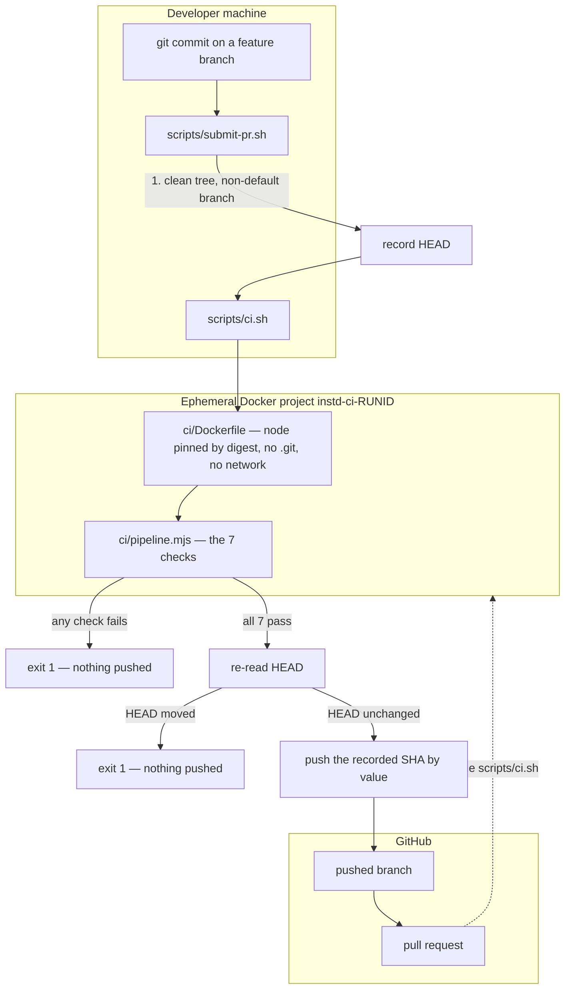

# Local CI and verified PR submission

GitHub remains where this repository lives, where pull requests are opened, and where review
happens. It is not where a branch proves itself. The complete pipeline runs on your machine, in a
container, before anything is pushed.

The whole arrangement exists to make one sentence true and checkable:

> **The commit pushed for a PR is exactly the commit that passed the complete local Docker CI
> pipeline.**

Not "a recent commit". Not "the branch". That commit.

## Prerequisites

| Tool | Why | Notes |
| --- | --- | --- |
| Docker (Engine 20.10+ with Compose v2) | The isolation boundary. Everything the pipeline needs is in the image. | `docker compose version` must work. |
| Git | Determines the commit under verification. | Git for Windows also supplies the `bash` the PowerShell entry points call. |
| GitHub CLI (`gh`), authenticated | Only for creating the pull request. | Optional — without it the verified commit is still pushed and you open the PR by hand. |

You do **not** need Node installed to run CI. Node lives in the image. The one exception is
`./scripts/ci.sh --no-docker`, which is for a runner that is already isolated.

## How to run local CI

```bash
./scripts/ci.sh
```

```powershell
.\scripts\ci.ps1
```

Options:

| Option | Effect |
| --- | --- |
| `--verbose` | Stream each check's output as it runs, instead of only on failure. |
| `--keep-on-failure` | Leave the failed container and its project in place for inspection. |
| `--no-docker` | Run the pipeline directly in the current environment. For a self-hosted runner that is already containerised. |

Exit codes: `0` the pipeline passed, `1` a check failed, `2` invocation or environment error
(no Docker daemon, missing compose file). Only `0` means verified.

## How to submit a verified PR

```bash
git commit -m "..."       # on a feature branch, working tree clean
./scripts/submit-pr.sh
```

```powershell
.\scripts\submit-pr.ps1
```

Options: `--base <branch>`, `--draft`, `--title <text>`, `--body <text>`, `--body-file <path>`,
`--no-pr` (verify and push, create nothing), `--verbose`.

The script never commits, never amends, never rebases, and never force-pushes. If your tree is
dirty, it stops and tells you; cleaning it up is your decision, not the tool's.

## The pipeline



## What CI checks

Seven checks, in this order, defined once in [`ci/pipeline.mjs`](../ci/pipeline.mjs). Cheap
structural gates first, so a misshapen repository fails in seconds; the verdict last, because it is
what the rest of the pipeline exists to make trustworthy.

| # | Check | Command | What it establishes |
| --- | --- | --- | --- |
| 1 | `inventory` | `npm run inventory` | The standards series has not silently changed shape. |
| 2 | `fidelity` | `npm run fidelity` | Every block claiming to be verbatim source is verbatim. |
| 3 | `policy` | `npm run policy` | This repository's own `project-policy.yml` is valid against the schema. |
| 4 | `diagrams` | `npm run diagrams` | No document is showing a diagram that no longer matches its `.mmd`. |
| 5 | `unit-tests` | `npm test` | The suite, including the meta-tests guarding the engine's own semantics. |
| 6 | `audit` | `npm run audit` | This repository audited by its own auditor. |
| 7 | `validate` | `npm run validate` | The verdict. Exits nonzero on a required-rule failure or `BLOCKED_BY_INVARIANT`. |

These are exactly the seven checks the GitHub workflow ran before local CI existed. Nothing was
dropped; `test/local-ci.test.mjs` fails if any of them ever is.

The pipeline **fails fast**. Checks after a failure do not run, and they are not recorded as passing
— they are simply absent from the result record, which reports `"result": "failed"`. A skip is never
a pass here, for the same reason it is never a pass in the compliance engine.

### Nothing was excluded as unreproducible

Every check runs locally, because every check is a zero-dependency Node program that reads files in
this repository. There is no service to stub, no browser to drive, no cloud resource to stand in for.

Two things that a GitHub-hosted run does and a local run does not, both outside the pipeline:

- **Artifact upload.** The workflow uploads `artifacts/local-ci/latest.json`. Locally, the file is
  simply on disk.
- **Running against a merge commit.** `pull_request` events build GitHub's merge of your branch into
  the base. Local CI verifies your commit as it stands. This is a real difference: local CI cannot
  tell you that your verified commit conflicts semantically with a base branch that moved after you
  branched. Rebase and re-run before submitting if the base has advanced.

## Databases and services

**This repository has no database and no service dependency.** It is a zero-dependency Node program
that reads Markdown, JSON, and YAML from disk. No database is provisioned, none is migrated, and
none is seeded — because there is nothing to provision, and standing up a database that no check
uses would be theatre.

The isolation model is written for the case anyway, because this pattern is meant to be reused:

- A service goes into [`compose.ci.yml`](../compose.ci.yml) — there is a worked SQL Server example
  in the comments there — and its name goes into `SERVICES` in `ci/pipeline.mjs`.
- `scripts/ci.sh` then starts it with `docker compose up -d --wait`, which blocks on the service's
  **declared healthcheck**. There are no `sleep` calls in the orchestrator, and there should never
  be one.
- The service lives in a per-run compose project, on that project's own network, with **no published
  host port**. Your development database is not reachable from CI and is never touched by it.
- Credentials come from the environment, never from a committed file. The example in
  `compose.ci.yml` uses `${LOCAL_CI_DB_PASSWORD:?...}`, which fails loudly rather than defaulting.
- Teardown destroys the project's containers, networks, **and volumes**, so the next run starts from
  nothing. `--keep-on-failure` is the explicit opt-out.

## Isolation, and what CI cannot reach

| Property | How |
| --- | --- |
| No developer state | The repository is **copied into the image**, not bind-mounted. No host directory is mounted at all. |
| No credentials | `.dockerignore` excludes `.git`, so no remote URL, no credential helper config, and no history reach the image. No token is baked in. |
| No network | The CI service runs with `network_mode: none`. It cannot reach the internet, your database, or anything else. |
| No root | The container runs as the unprivileged `node` user. |
| No Docker socket | The socket is not mounted. CI cannot start containers or see other containers. |
| No collisions | Every run gets its own compose project, `instd-ci-<timestamp>-<pid>`. Two repositories, or two concurrent runs, cannot interfere. |
| Deterministic base | The base image is pinned by **digest**, not by the `node:20-alpine` tag, so the image cannot change underneath a commit. |

Two honest qualifications. **The image build has network access** — it pulls the pinned base image
and installs `bash` and `git`, which the suite needs to prove the invariant. Only the *run* is
network-isolated. And because those two packages come from Alpine's repositories at build time, the
image is reproducible in structure but not byte-for-byte across months; the base image is what is
pinned.

The test suite genuinely writes to the source tree — `test/diagrams.test.mjs` rewrites
`docs/architecture.mmd` and restores it — which is the second reason for copying rather than
mounting: a bind mount would let the suite modify your checkout.

## Cleanup, and debugging a failure

Teardown runs from a shell `trap` on `EXIT`, `INT`, and `TERM`, so it happens whether the pipeline
passed, failed, or you pressed Ctrl-C. It is `docker compose -p <this run's project> down --volumes
--remove-orphans`, which is scoped to the project this run created: **it cannot see or remove
containers, networks, volumes, or databases belonging to anything else.**

To inspect a failure instead:

```bash
./scripts/ci.sh --keep-on-failure
```

The script then prints the container name, the project name, and the exact commands to read its
logs, open a shell in the image, and clean up when you are done. Useful next steps:

```bash
docker logs <container>                                  # what the failing check printed
docker run --rm -it innovation-standards-ci:local sh     # poke around the image the checks saw
docker compose -f compose.ci.yml -p <project> down --volumes --remove-orphans
```

`./scripts/ci.sh --verbose` streams every check's output as it happens, which is usually faster than
opening a shell.

## The verification record

A successful run prints the repository, branch, verified commit, result, the stages and checks
executed, and a completion timestamp. It also writes `artifacts/local-ci/latest.json`:

```json
{
  "commit": "fdcc809f03f86571c7c6bf7e23788af937eeb2eb",
  "branch": "feature/local-docker-ci",
  "tree": "clean",
  "result": "passed",
  "environment": "docker",
  "checks": ["inventory", "fidelity", "policy", "diagrams", "unit-tests", "audit", "validate"],
  "failedCheck": null
}
```

`tree` is there for honesty. Running `ci.sh` directly on a dirty working tree verifies the *tree*,
not the commit `HEAD` points at, and the record says `"tree": "dirty"` so the SHA in it cannot be
mistaken for a certificate. `submit-pr.sh` refuses to run in that state at all.

The directory is **git-ignored**. A CI result is transient evidence of a run; this repository's
evidence-retention policy is about proposals and experiments, and a CI record is neither.

## Local CI is not GitHub Actions

Both exist, and they are not the same claim.

- **Local CI** is what `./scripts/ci.sh` does on your machine, in Docker, before a push. It is what
  the exact-commit invariant is about.
- **GitHub Actions** ([`.github/workflows/ci.yml`](../.github/workflows/ci.yml)) still runs on push
  and pull request. It was not deleted, and it was not left to drift: it now checks out and runs
  `./scripts/ci.sh` — the same script, the same image, the same seven checks. There is no second
  copy of the pipeline in YAML.

The PR body written by `submit-pr.sh` says *local containerized verification performed before the
push*, and says explicitly that it is not a report of a GitHub-hosted run. If GitHub-hosted Actions
are unavailable — quota, billing, a disabled workflow — local CI is unaffected and remains a
complete verification. It never claims Actions passed.

Adding a self-hosted runner later needs one edit: `runs-on: self-hosted` in the workflow. The step
already calls the same command.

## The invariant, mechanically

`scripts/submit-pr.sh` in order:

1. Confirm this is a git repository.
2. Refuse a detached `HEAD`, the default branch, and a base equal to the branch.
3. Refuse a dirty working tree — otherwise the tree that CI tests and the commit that gets pushed
   can differ, and the invariant becomes unenforceable.
4. Record `git rev-parse HEAD` as `SHA_BEFORE`.
5. Run `scripts/ci.sh`.
6. On failure: `CI failed. No branch was pushed and no PR was created.`
7. Read `git rev-parse HEAD` again.
8. If it differs: `HEAD changed after CI verification. The current commit has not been verified.
   Re-run CI before submitting.` — and nothing is pushed. The tree is re-checked for dirtiness here
   too.
9. Push **by SHA**: `git push origin <SHA_BEFORE>:refs/heads/<branch>`, then confirm with
   `git ls-remote` that the remote branch is at that SHA. Pushing the value rather than the ref name
   means that even a race cannot substitute a different commit.
10. Create the PR with the developer's existing `gh` session. Any `--body`/`--body-file` you supply
    is kept, and the verification block is appended beneath it.

Steps 3, 6, 8, and 9 are covered by tests in
[`test/local-ci.test.mjs`](../test/local-ci.test.mjs), which run the real script against a throwaway
repository with a throwaway remote and a fake pipeline injected through `LOCAL_CI_COMMAND`. The
`HEAD`-moved test uses a fake pipeline that passes *and* commits while it runs, then asserts both
the refusal and that the remote received nothing.

## Reusing this in another repository

Copy `compose.ci.yml`, `ci/`, `.dockerignore`, and the four scripts. Then:

1. Replace the `CHECKS` array in `ci/pipeline.mjs` with that repository's commands.
2. Change the base image in `ci/Dockerfile` to that repository's toolchain, pinned by digest.
3. Add any service to `compose.ci.yml` and to `SERVICES`.
4. Change the `instd-ci-` project prefix in `scripts/ci.sh` so runs stay distinguishable.

Nothing else in the scripts is specific to this repository.
